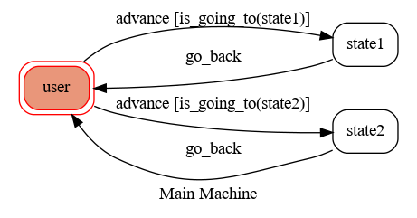

# ToC Project 2020

[](https://codeclimate.com/github/NCKU-CCS/TOC-Project-2020/maintainability)

[](https://snyk.io/test/github/NCKU-CCS/TOC-Project-2020)


Template code for ToC Project 2020.

A LINE bot based on a finite state machine.

More details are available in [the slides](https://hackmd.io/@TTW/ToC-2019-Project#) and [the FAQ](https://hackmd.io/s/B1Xw7E8kN)

## Setup

### Prerequisites
* Python 3.8
* Pipenv
* LINE messaging API
* An HTTPS server

#### Install Dependencies
```sh
pip3 install pipenv

pipenv --three

pipenv install

pipenv shell
```

* pygraphviz (For visualizing finite state machines)
    * [Setting up pygraphviz on Ubuntu](https://www.jianshu.com/p/a3da7ecc5303)
	* [Note: Installation errors on macOS](https://github.com/pygraphviz/pygraphviz/issues/100)


#### Secret Data
You should create a file `.env` to set up environment variables. The file `.env.sample` serves as an example.
`LINE_CHANNEL_SECRET` and `LINE_CHANNEL_ACCESS_TOKEN` **MUST** be set to the proper value.
Otherwise, you might not be able to run your code.

#### Run Locally
You can either set up an HTTPS server or use `ngrok` as a proxy.

#### a. Ngrok Installation
* [Instructions](https://ngrok.com/download) (for macOS, Windows, and Linux)

Alternatively, you can use Homebrew for installation (for macOS)
```sh
brew cask install ngrok
```

To run `ngrok`:
```sh
ngrok http 8000
```

And then `ngrok` will display an HTTPS URL to use.

#### Run the Server

```sh
python3 app.py
```

#### b. Servo

Alternatively, you can use [Servo](https://servo.org/) to expose local servers to the internet.

## Finite State Machine


## Usage
The initial state is set to `user`.

When the state is triggered to `advance` to another state from state `user`, it will `go_back` to the state `user` after the bot replies the message that has triggered it.

* user
	* Input: "go to state1"
		* Reply: "I'm entering state1"

	* Input: "go to state2"
		* Reply: "I'm entering state2"

## Deploy
Settings to deploy webhooks on Heroku.

### Heroku CLI Installation

* [Instructions](https://devcenter.heroku.com/articles/heroku-cli) (for macOS and Windows)

Alternatively, you can use Homebrew for installation (for macOS)
```sh
brew tap heroku/brew && brew install heroku
```

or use Snap (for Ubuntu 16+)
```sh
sudo snap install --classic heroku
```

### Connect to Heroku

1. Create an account on Heroku: https://signup.heroku.com

2. Create a Heroku project on the website

3. Log in with CLI

	```
	heroku login
	```

### Upload Project to Heroku

1. Add local project to Heroku project

	```
	heroku git:remote -a {HEROKU_APP_NAME}
	```

2. Upload project

	```
	git add .
	git commit -m "Add code"
	git push -f heroku master
	```

3. Set environment - LINE messaging API secret keys

	```
	heroku config:set LINE_CHANNEL_SECRET=your_line_channel_secret
	heroku config:set LINE_CHANNEL_ACCESS_TOKEN=your_line_channel_access_token
	```

4. Your project is now running on Heroku!

	url: `{HEROKU_APP_NAME}.herokuapp.com/callback`

	debug command: `heroku logs --tail --app {HEROKU_APP_NAME}`

5. If failed with `pygraphviz` installation errors,

	running the commands below may solve the problems:
	```
	heroku buildpacks:set heroku/python
	heroku buildpacks:add --index 1 heroku-community/apt
	```

	Reference: https://hackmd.io/@ccw/B1Xw7E8kN?type=view#Q2-如何在-Heroku-使用-pygraphviz

## References
[Pipenv](https://medium.com/@chihsuan/pipenv-更簡單-更快速的-python-套件管理工具-135a47e504f4) ❤️ [@chihsuan](https://github.com/chihsuan)

[TOC-Project-2019](https://github.com/winonecheng/TOC-Project-2019) ❤️ [@winonecheng](https://github.com/winonecheng)

Flask Architecture ❤️ [@Sirius207](https://github.com/Sirius207)

[line-bot-sdk-python](https://github.com/line/line-bot-sdk-python/tree/master/examples/flask-echo)
