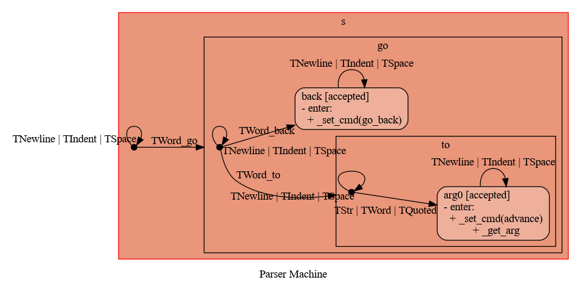
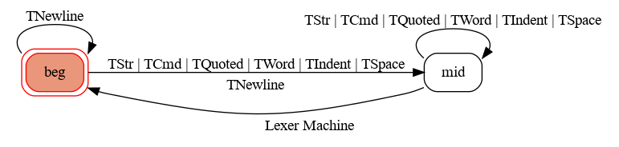

# ToC Project 2021

[](https://codeclimate.com/github/IepIweidieng/duzhi-bot-2021/maintainability)


Template code for ToC Project 2021.

A LINE bot based on finite state machines.

More details are available in [the slides](https://hackmd.io/@TTW/ToC-2019-Project#) and [the FAQ](https://hackmd.io/s/B1Xw7E8kN)

## Environment

### Prerequisites
* Python >= 3.6
* LINE messaging API channel secret & access token

### Development Environment
* Ubuntu 20.04 on WSL2 (Windows 10)
* Python 3.8
* Pipenv
* ngrok
* Heroku PostgreSQL

### Deployment Environment
* Heroku

## Setup

### Install Dependencies
Make sure that you are in the project directory and then:
```sh
python -m pip install pipenv
pipenv --three
pipenv install
```

#### pygraphviz
* Required for visualizing finite state machines.

To avoid installation errors,
the version provided by the package manager of your OS or distro should be used.

To install such version on Ubuntu 20.04:
```sh
sudo apt install graphviz graphviz-dev
```

Note: On macOS, if you still encounter installation errors, the following issue might help:
https://github.com/pygraphviz/pygraphviz/issues/100

#### psycopq2
* Required for accessing the PostgreSQL database

Likewisely, the package manager version should be used:
```sh
sudo apt install python3-psycopg2 libpq-dev
```

### Set up the Secrets
You should create a file `.env` to set up the environment variables.
The file `.env.sample` serves as an example.

The following environment variables **MUST** be set to their proper value:
* `LINE_CHANNEL_SECRET`&mdash;LINE messaging API channel secret
* `LINE_CHANNEL_ACCESS_TOKEN`&mdash;LINE messaging API channel access token
* `DATABASE_URL`&mdash;PostgreSQL database URL (explained below)
    * *Note*: If Heroku PostgreSQL is used, `DATABASE_URL` should *not* be set in `.env`.

Otherwise, you might not be able to run the app server.

### Prepare the Database

Make sure you have set up a PostgreSQL database.
`DATABASE_URL` should be set to the URL to your database.

You can use the one provided by Heroku PostgreSQL as explained in [Preparation&mdash;Create a Heroku Project](#preparationcreate-a-heroku-project).

However, if you chose to use Heroku PostgreSQL,
you should use the database URL as the follow instead since the URL *can* change
(see [Deployment](#deployment) for details):
```sh
DATABASE_URL=$(heroku config:get DATABASE_URL -a {HEROKU_APP_NAME}) pipenv run python app.py
```

* Reference: https://devcenter.heroku.com/articles/connecting-to-heroku-postgres-databases-from-outside-of-heroku

For simplicity, in the following instructions,
such commands will be prepended with `DATABASE_URL={...}`, as in:
```sh
DATABASE_URL={...} pipenv run python app.py
```

To initialize the database:
```sh
DATABASE_URL={...} pipenv run python -c 'import app; app.db.create_all()'
```

If the database were not initialized,
the database operations would fail and the app server would return 500.

### Test the App Server Locally
To run the app with the Flask built-in WSGI server (Werkzeug) in debug mode,
execute the following command in a new terminal window:
```sh
DATABASE_URL={...} pipenv run python app.py
```

Now, you might want to set up an HTTPS proxy server
in order to expose the local server to the internet.

[Ngrok](https://ngrok.com/) will be used here as an example.

However, other proxy servers such as NGINX may also work for you.

#### Ngrok

To install Ngrok on Ubuntu 20.04 on WSL2:
```sh
curl -s https://ngrok-agent.s3.amazonaws.com/ngrok.asc |
    sudo tee /etc/apt/trusted.gpg.d/ngrok.asc >/dev/null &&
    echo "deb https://ngrok-agent.s3.amazonaws.com buster main" |
    sudo tee /etc/apt/sources.list.d/ngrok.list &&
    sudo apt update && sudo apt install ngrok
```
* Reference: https://ngrok.com/download
* The registration steps are not required.

To run `ngrok`, execute the following command in another new terminal window:
```sh
ngrok http 8000
```

An HTTPS URL to use will then be displayed.

Note that the URL will be different each time `ngrok` is invoked.

### Set up the LINE messaging API Webhook

You can now set the webhook URL to the HTTPS URL you acquired.

To make LINE able to invoke the main webhook handler,
append the URL with `/callback`.

## Finite State Machines

### Main Machine


### Parser Machine


### Lexer Machine


## Usage
The initial state is set to `user`.

When the state is triggered to `advance` to another state from state `user`, it will `go_back` to the state `user` after the bot replies the message that has triggered it.

* user
	* Input: "go to state1"
		* Reply: "I'm entering state1"

	* Input: "go to state2"
		* Reply: "I'm entering state2"

## Deployment
This paragraph covers how to deploy this app server to Heroku by using the Heroku git repository.

For more details, please refer to https://devcenter.heroku.com/articles/git

### Preparation&mdash;Log in

Make sure that Heroku CLI is installed.

To install Heroku CLI on Ubuntu 20.04 on WSL2:
```sh
curl https://cli-assets.heroku.com/install.sh | sh
```

* Reference: https://devcenter.heroku.com/articles/heroku-cli

Make sure that you have a working Heroku account.
You might need to create an Heroku account here: https://signup.heroku.com

To log in with the CLI:
```sh
heroku login
```

In case it fails to open the browser or you just prefer using the CLI:
```sh
heroku login -i
```

### Preparation&mdash;Create a Heroku Project

*Notes*:
* Substitute `{HEROKU_APP_NAME}` with your real project name
* Also substitute `{your_...}` and the like with the real value
* You can omit `-a {HEROKU_APP_NAME}` by executing the following command beforehand:
    ```sh
    export HEROKU_APP={HEROKU_APP_NAME}
    ```

1. Create a Heroku project:
    ```sh
    heroku create {HEROKU_APP_NAME}
    ```
2. Set up the project
    ```sh
    heroku buildpacks:set heroku/python -a {HEROKU_APP_NAME}
    heroku buildpacks:add --index 1 heroku-community/apt -a {HEROKU_APP_NAME}
    heroku addons:create heroku-postgresql:hobby-dev -a {HEROKU_APP_NAME}
    ```
3. Set up the secrets:
    ```sh
    heroku config:set LINE_CHANNEL_SECRET={your_line_channel_secret} -a {HEROKU_APP_NAME}
    heroku config:set LINE_CHANNEL_ACCESS_TOKEN={your_line_channel_access_token} -a {HEROKU_APP_NAME}
    ```

You can now check the `DATABASE_URL` environment variable set up by `heroku-postgresql`
with the following command:
```sh
heroku config:get DATABASE_URL -a {HEROKU_APP_NAME}
```

### Deploy

Make sure that you have your git project set up already.

1. Add the Heroku git repository as a remote to your local git project:
    ```sh
    heroku git:remote -a {HEROKU_APP_NAME}
    ```
2. Push your local git project to Heroku git:
    ```sh
    git push heroku
    ```

And your project should now be running smoothly on Heroku.

Remember to set the webhook URL for the LINE meesage API: `https://{HEROKU_APP_NAME}.herokuapp.com/callback`

To Re-deploy:
```sh
git push -f heroku
```

To inspect the log (for debugging purposes):
```sh
heroku logs --tail -a {HEROKU_APP_NAME}
```

## References
[Pipenv](https://medium.com/@chihsuan/pipenv-更簡單-更快速的-python-套件管理工具-135a47e504f4) ❤️ [@chihsuan](https://github.com/chihsuan)

[TOC-Project-2019](https://github.com/winonecheng/TOC-Project-2019) ❤️ [@winonecheng](https://github.com/winonecheng)

Flask Architecture ❤️ [@Sirius207](https://github.com/Sirius207)

[line-bot-sdk-python](https://github.com/line/line-bot-sdk-python/tree/master/examples/flask-echo)

[Graphviz Attributes](https://graphviz.org/doc/info/attrs.html)

[SQLAlchemy ORM](https://docs.sqlalchemy.org/en/latest/orm/)
